# Guía de uso — Local AI Studio

Cómo instalarlo, arrancarlo, y qué hacer en cada pantalla. Todas las
capturas de abajo son reales — sacadas ejecutando el propio panel, no
maquetas.

## Índice

- [¿Qué es esto?](#qué-es-esto)
- [Instalar](#instalar)
- [Arrancar](#arrancar)
- [Primer uso](#primer-uso)
- [Pantalla por pantalla](#pantalla-por-pantalla)
- [¿Dónde va cada cosa?](#dónde-va-cada-cosa)
- [Lo que ha cambiado por dentro](#lo-que-ha-cambiado-por-dentro)
- [Problemas comunes](#problemas-comunes)

## ¿Qué es esto?

**local-ai-stack-template** es el repositorio (el código, en GitHub).
**Local AI Studio** es el nombre que ves dentro del panel web cuando lo
arrancas — son la misma cosa, solo que uno es "la caja" y el otro "lo
que ves al abrirla".

Sirve para montar cualquier proyecto de IA local sin reconstruir
siempre lo mismo: una cola de tareas que no pierde trabajo si algo
falla, un RAG real (subes documentos, preguntas, y la respuesta viene
con la cita exacta de dónde salió), y **proyectos separados** — puedes
tener "TBC-IA", "Heridas", o cualquier otra cosa, cada uno con sus
propios documentos, su propio modelo, su propia configuración, sin que
se mezclen entre sí.

## Instalar

Se hace una vez por máquina.

### macOS

```bash
brew install postgresql@16 redis
brew services start postgresql@16
brew services start redis

git clone https://github.com/marcjante/local-ai-stack-template.git
cd local-ai-stack-template
pip3 install -r requirements.txt

createdb stack_template
python3 -c "from db.db import init_schema; init_schema()"

# Opcional, para modelos locales de verdad
brew install ollama
ollama pull llama3.1
```

> **Ojo con el usuario de Postgres.** Homebrew crea el rol con tu
> usuario de Mac, no como `postgres`. Si ves
> `role "postgres" does not exist`, usa tu usuario real en
> `DATABASE_URL` (ver [Problemas comunes](#problemas-comunes)).

> **zsh no admite comentarios `#` a mitad de línea en modo
> interactivo** — si copias un comando con un `#` detrás, quítalo, o
> zsh intentará interpretarlo como argumento y dará error.

### Linux (Ubuntu/Debian)

```bash
sudo apt update
sudo apt install postgresql redis-server python3-pip git
sudo systemctl enable --now postgresql redis-server

git clone https://github.com/marcjante/local-ai-stack-template.git
cd local-ai-stack-template
pip3 install -r requirements.txt

sudo -u postgres createdb stack_template
sudo -u postgres psql -c "ALTER USER postgres PASSWORD 'postgres';"
python3 -c "from db.db import init_schema; init_schema()"

# Opcional
curl -fsSL https://ollama.com/install.sh | sh
ollama pull llama3.1
```

> **Conflicto conocido de `pip` con paquetes del sistema.** En sistemas
> donde Python está gestionado por `apt`, actualizar un paquete que el
> sistema ya trae (típicamente `PyJWT`) puede dar
> `ERROR: Cannot uninstall X, RECORD file not found`. No suele bloquear
> nada — la versión ya instalada funciona igual. Compruébalo con
> `python3 -c "import jwt"` después de instalar.

### Windows

> **Redis no tiene soporte oficial en Windows.** Dos opciones reales:
> **(A) WSL2** (recomendado — instalas Ubuntu dentro de Windows y sigues
> los pasos de Linux de arriba), o **(B) Docker Desktop** (Redis y
> Postgres como contenedores, con Python nativo en Windows). Lo de
> abajo asume la opción B.

```powershell
docker run -d --name redis -p 6379:6379 redis
docker run -d --name postgres -p 5432:5432 -e POSTGRES_PASSWORD=postgres postgres:16

git clone https://github.com/marcjante/local-ai-stack-template.git
cd local-ai-stack-template
pip install -r requirements.txt

docker exec -it postgres createdb -U postgres stack_template
python -c "from db.db import init_schema; init_schema()"
```

Instala Python 3.11+ marcando "Add python.exe to PATH", y
[Git para Windows](https://git-scm.com/download/win). Si PowerShell
bloquea scripts: `Set-ExecutionPolicy -Scope CurrentUser RemoteSigned`.
Ollama: descarga desde
[ollama.com/download/windows](https://ollama.com/download/windows).

## Arrancar

Cada vez que quieras usarlo. Necesitas 3 terminales:

```bash
# Terminal 1 — el motor que procesa las tareas
rq worker process --url redis://127.0.0.1:6379/0

# Terminal 2 — el backend (API)
python3 backend/main.py

# Terminal 3 — el panel (esto es lo que abres en el navegador)
python3 dashboard/dashboard_service.py
```

En Windows, sustituye `python3` por `python` y las barras `/` por `\`
en las rutas.

Y abre en el navegador: `http://localhost:8090`

## Primer uso

La primera vez que abres el panel, te recibe esto — comprueba que todo
lo necesario está bien antes de dejarte pasar:

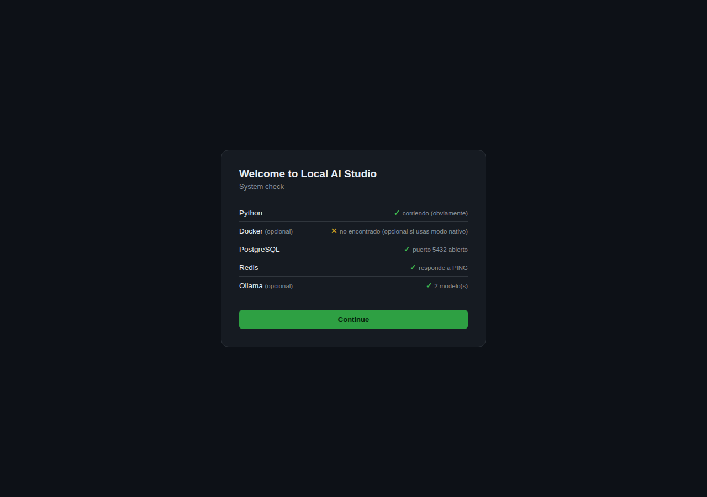

Python, PostgreSQL y Redis son **imprescindibles** (deben salir en
verde para poder continuar). Docker y Ollama son **opcionales** — si no
los tienes, sale en ámbar y te deja seguir igual (es lo normal en modo
nativo, sin Docker).

**Qué hacer aquí**: pulsa "Continue", elige un modo de uso (Local only
si vas a trabajar solo con Ollama), y ya entras al Dashboard.

## Pantalla por pantalla

Todo lo de abajo está en el menú de la izquierda. El proyecto activo se
ve arriba del todo del menú — todo lo que veas en Knowledge, Tasks,
Playground, etc. es **solo de ese proyecto**.

### Dashboard

`http://localhost:8090/`

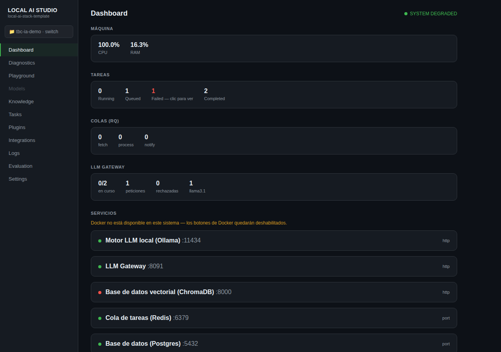

Vista general: CPU/RAM de la máquina, cuántas tareas están
corriendo/en cola/falladas/completadas, las colas de Redis, el estado
del LLM Gateway, y cada servicio con un punto verde/rojo.

**Qué hacer aquí**: pulsa en un servicio para desplegarlo y ver
botones de arrancar/parar/ver logs. Pulsa en "Failed" si hay tareas
fallidas — te lleva directo a verlas con su error exacto.

### Diagnostics

`/diagnostics`

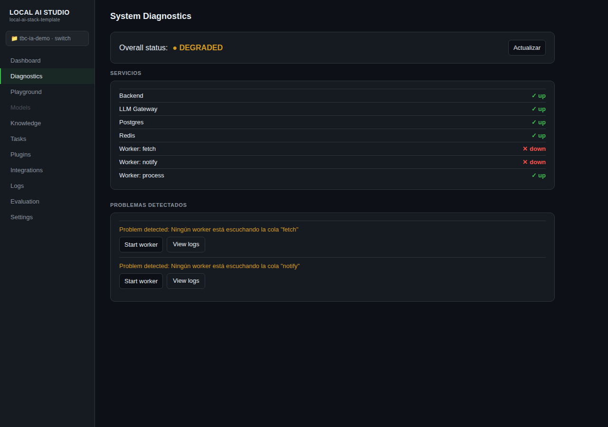

Va más allá de "¿está encendido?" — detecta problemas concretos, como
una cola con tareas esperando pero sin ningún worker escuchándola (el
caso que más confunde: todo parece sano por separado, pero nada se
procesa).

**Qué hacer aquí**: si el estado general sale en amarillo/rojo, mira
"Problemas detectados" — cada uno trae un botón para arreglarlo
directamente (ej. "Start worker").

### Playground

`/playground`

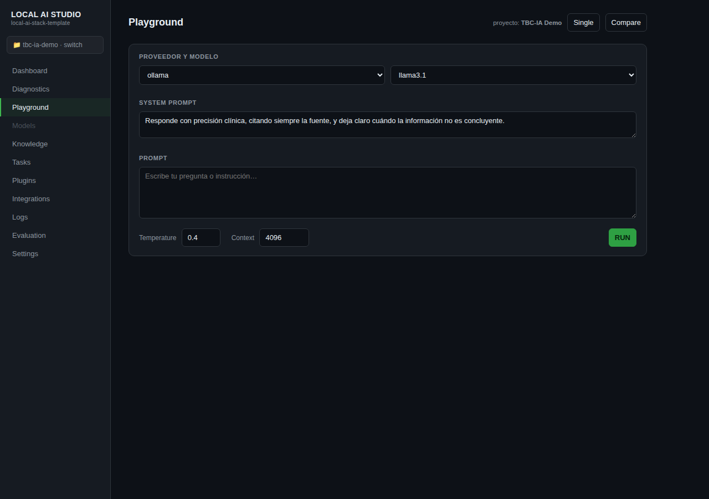

Para probar un modelo suelto, sin montar nada. Al abrirlo, ya viene
precargado con el modelo/prompt/temperature configurados para el
proyecto activo.

**Qué hacer aquí**: escribe un prompt y pulsa RUN. Usa la pestaña
"Compare" si quieres poner dos modelos a competir con el mismo prompt y
ver latencia/tokens de cada uno.

### Models

`/models`

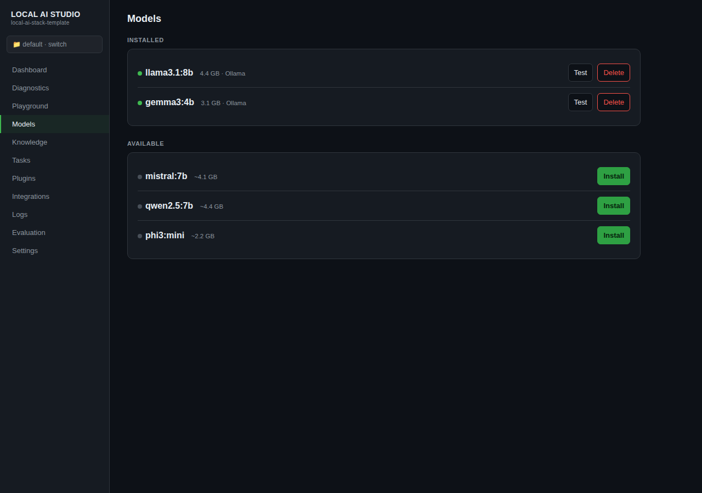

Modelos de Ollama instalados de verdad (consultando Ollama, no una
lista inventada), y un catálogo de disponibles para instalar. El botón
"Test" ejecuta un benchmark real (TTFT, tokens/segundo, RAM).

**Qué hacer aquí**: "Install" para descargar un modelo nuevo (tarda,
corre en segundo plano). "Test" para ver el rendimiento real de uno
instalado antes de usarlo en un proyecto.

### Knowledge

`/knowledge`

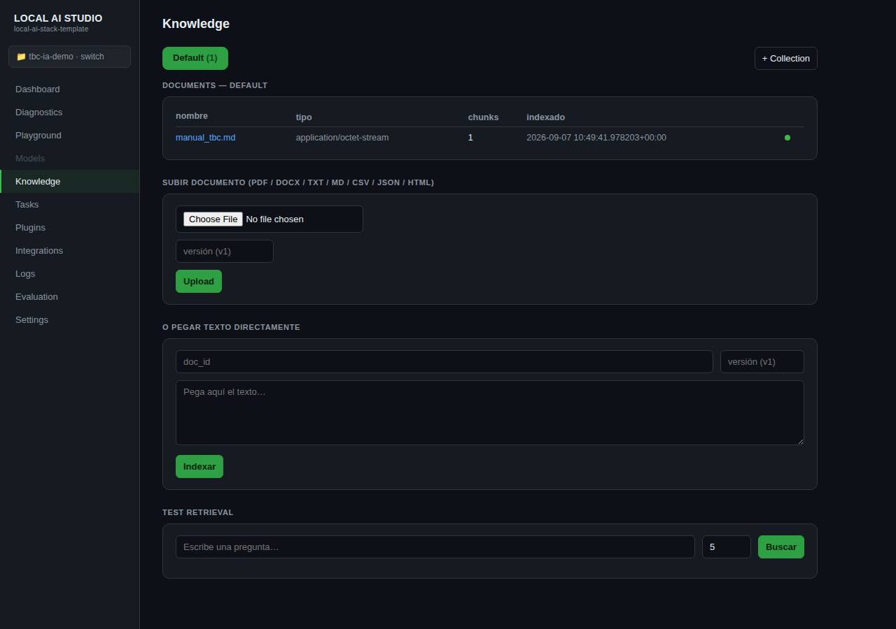

Aquí subes los documentos que quieres que el sistema conozca. Acepta
PDF, DOCX, TXT, MD, CSV, JSON y HTML — cada uno se convierte a texto y
se trocea automáticamente.

**Qué hacer aquí**: "Choose File" → "Upload". Crea una colección nueva
con "+ Collection" si quieres organizar por temas. Abajo puedes probar
"Test retrieval" — escribe una pregunta y ve qué fragmento encontraría
el sistema.

### Knowledge → un documento

`/knowledge/<nombre-del-fichero>`

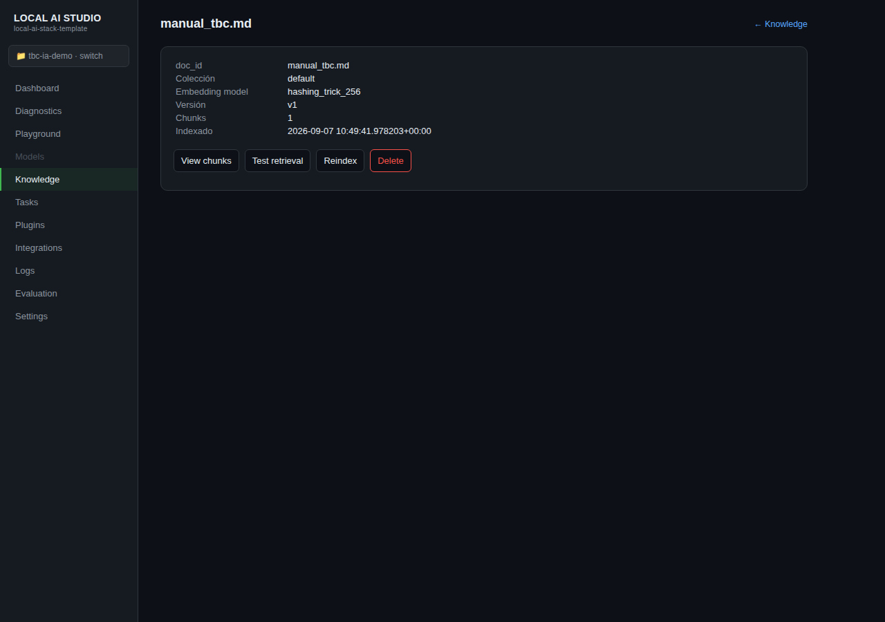

Al pulsar sobre un documento en la lista, ves sus datos: colección,
modelo de embeddings, versión, cuántos fragmentos ("chunks") se
generaron, y cuándo se indexó.

**Qué hacer aquí**: "View chunks" para ver los trozos exactos.
"Reindex" si cambias la configuración de chunking. "Delete" para
borrarlo del todo.

### Tasks

`/tasks-view`

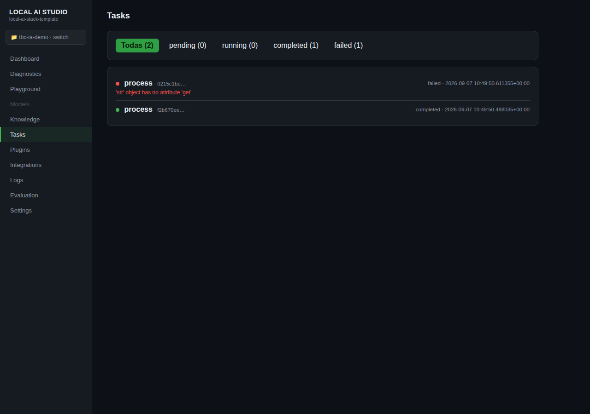

Cada vez que el sistema procesa algo (una pregunta al RAG, un flujo
automático) se queda registrado aquí como una tarea, con su estado.

**Qué hacer aquí**: filtra por estado arriba. Pulsa sobre una tarea
para desplegar su auditoría — qué pasos siguió el sistema y qué decidió
en cada uno.

### Plugins

`/plugins`

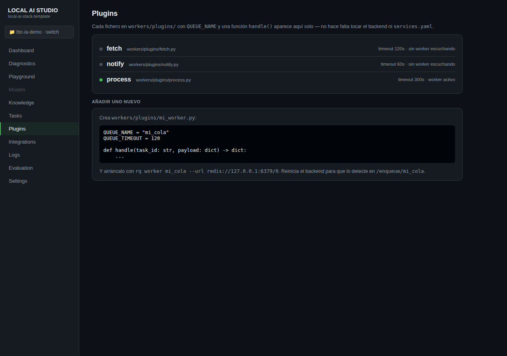

Los "workers" (los procesos que hacen el trabajo pesado) aparecen aquí
solos, sin que tengas que registrarlos en ningún sitio.

**Qué hacer aquí**: solo para consultar qué hay disponible. Añadir uno
nuevo se hace desde código (un fichero en `workers/plugins/`), no desde
aquí.

### Integrations

`/integrations`

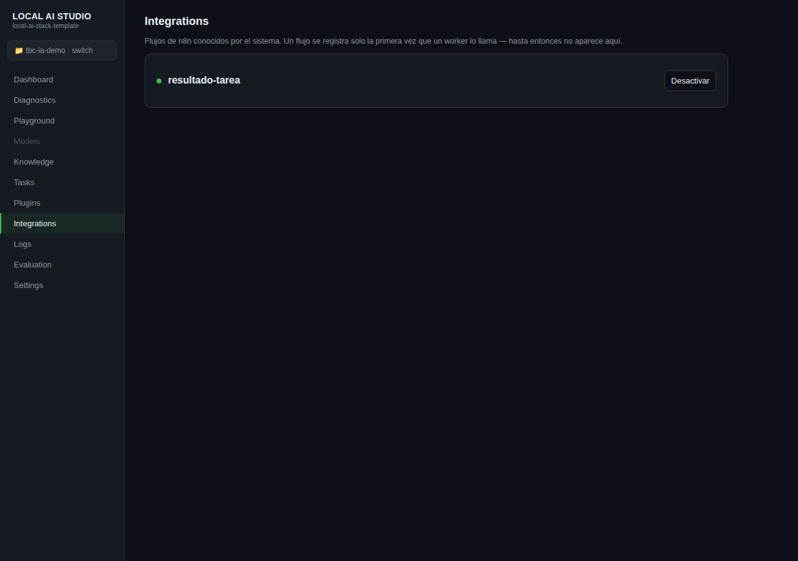

Conexiones con n8n. Cada flujo se puede encender/apagar por proyecto
sin tocar código.

**Qué hacer aquí**: si no usas n8n, no hay nada que hacer — se queda
vacío hasta que algún flujo se use por primera vez.

### Logs

`/logs-view`

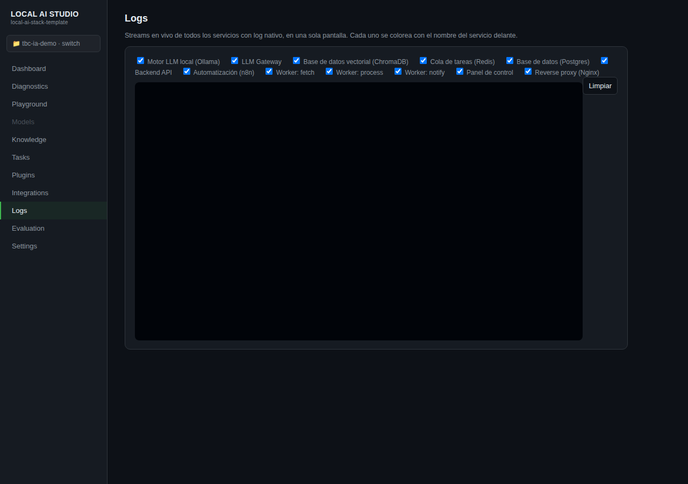

Todos los servicios con log nativo, juntos en una sola pantalla, cada
línea coloreada según de qué servicio viene.

**Qué hacer aquí**: marca/desmarca qué servicios quieres ver. Útil
cuando algo falla y quieres ver el error en el momento en que pasa.

### Evaluation

`/evaluation`

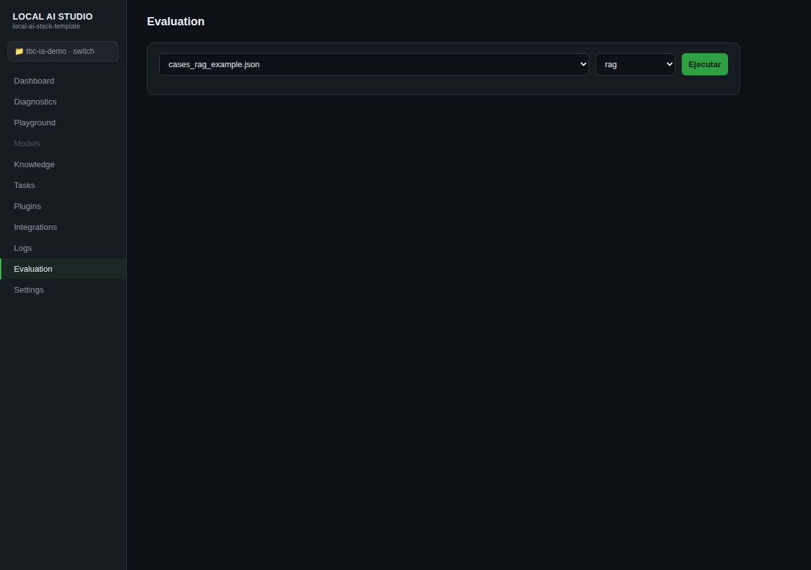

Ejecuta pruebas automáticas contra el RAG o contra un worker,
comparando lo que responde contra lo que se espera.

**Qué hacer aquí**: elige un fichero de casos y un objetivo, pulsa
"Ejecutar". El resultado (y su histórico) también se ve en el
Dashboard del proyecto.

### Settings

`/settings`

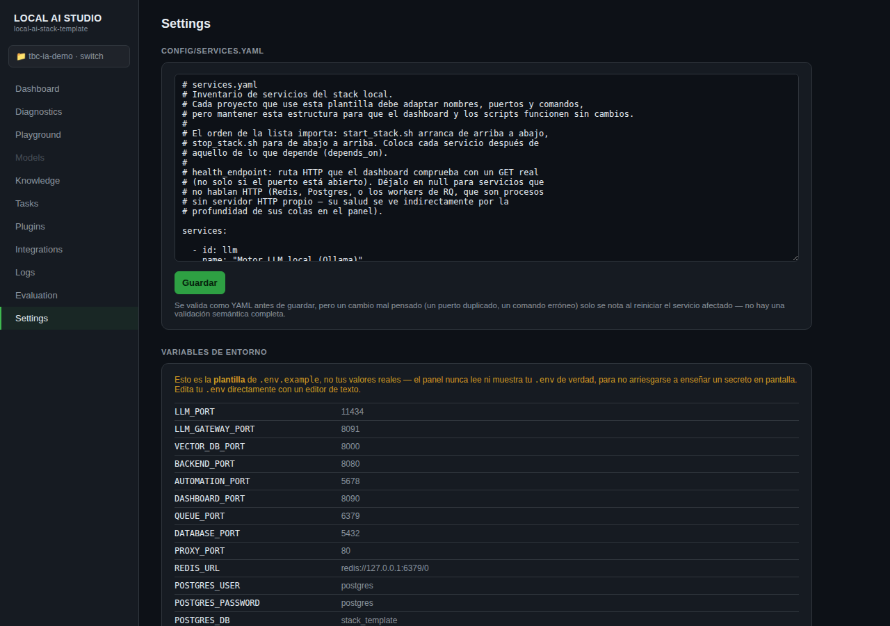

Edición de `config/services.yaml` (validado antes de guardar), y
**Backup / Restore**: exporta toda la instalación a un `.zip`, o
restaura uno.

**Qué hacer aquí**: haz un "Export backup" de vez en cuando, sobre todo
antes de cambios grandes. El `.env` real nunca se toca desde aquí.

### Projects

`/projects`

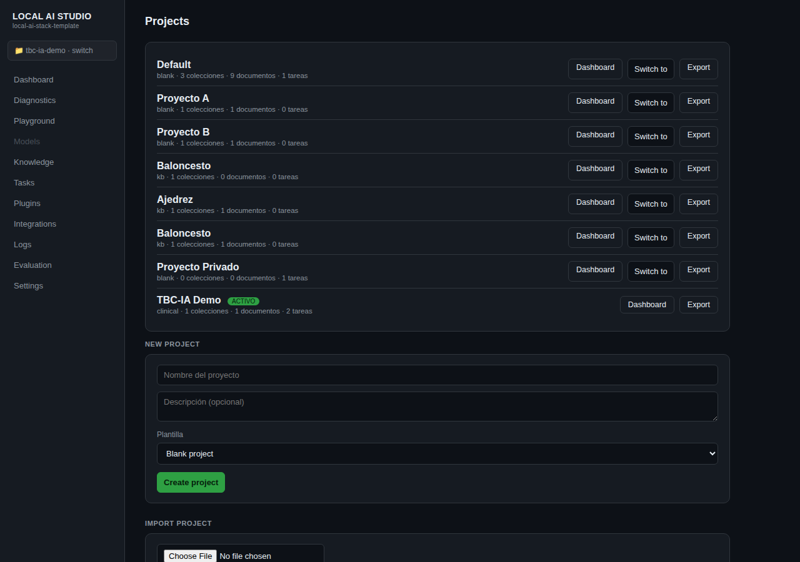

La lista de todos tus proyectos. Cada uno tiene sus propios documentos,
tareas y configuración, completamente aislados de los demás.

**Qué hacer aquí**: "Switch to" para cambiar de proyecto activo. Para
crear uno nuevo, rellena el formulario eligiendo una plantilla (solo
predefinen el prompt inicial, se puede cambiar después).

### Project Dashboard

`/projects/<id-del-proyecto>`

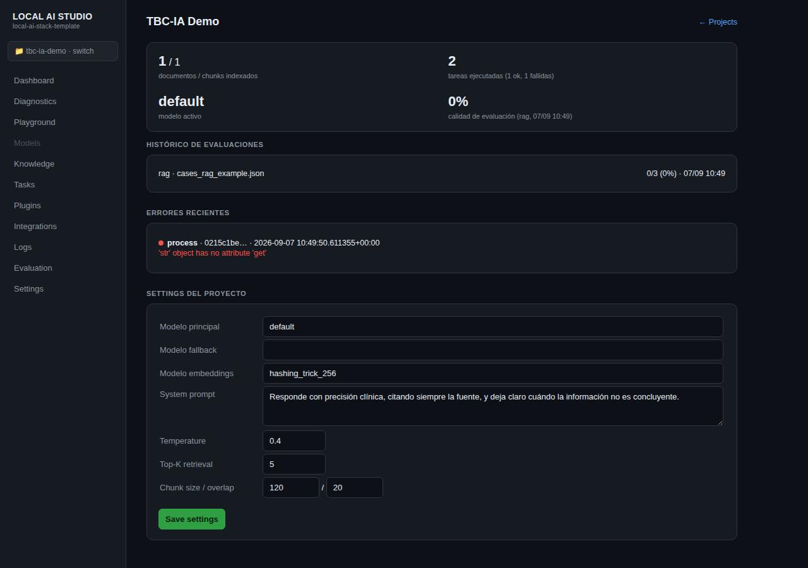

El resumen de un proyecto concreto: documentos/chunks indexados, tareas
ejecutadas, modelo activo, calidad de la última evaluación, errores
recientes, e histórico de evaluaciones.

**Qué hacer aquí**: es la pantalla para revisar "¿cómo va este
proyecto?" de un vistazo. Debajo puedes editar y guardar su
configuración.

## ¿Dónde va cada cosa?

| Quiero... | Voy a... |
|---|---|
| Subir un documento nuevo | Panel → Knowledge → Upload |
| Cambiar el modelo/prompt de un proyecto | Panel → ese proyecto → Project Dashboard → Settings del proyecto |
| Añadir un worker nuevo | Un fichero en `workers/plugins/tu_worker.py` con `QUEUE_NAME` y `handle()` |
| Añadir un formato de fichero a Knowledge | Una función en `rag/file_parsers.py` + entrada en `EXTRACTORS` |
| Cambiar puertos o servicios | `config/services.yaml` (también editable desde Settings) |
| Configurar contraseñas/API keys reales | `.env` (nunca se sube a git, nunca se muestra desde el panel) |
| Guardar una copia de seguridad | Panel → Settings → Export backup |
| Copiar un proyecto a otro ordenador | Panel → Projects → Export → `.ai-project.zip` |
| Cambiar el esquema de la base de datos | `alembic revision -m "..."` — no editar `schema.sql` a mano |
| Ver qué ha cambiado en cada ronda | [`docs/architecture.md`](architecture.md) — el diario técnico completo |

## Lo que ha cambiado por dentro

Estas mejoras no son una pantalla nueva, pero cambian cómo funciona
todo lo de arriba:

- **Multi-proyecto de verdad**: cada proyecto está completamente
  aislado, probado a nivel de base de datos y a través de la interfaz.
- **Permisos por proyecto**: roles `admin`/`editor`/`viewer` en el
  backend (el panel web sigue sin login).
- **Backup / Restore**: probado de forma destructiva — se borró algo,
  se restauró, y volvió.
- **Migraciones formales (Alembic)**: historial real de cambios de
  esquema, con rollback:
  ```bash
  alembic upgrade head       # instalación nueva
  alembic stamp head         # instalación ya existente
  alembic downgrade -1       # deshacer el último cambio
  ```
- **Tests automáticos + GitHub Actions**: se ejecutan solos en cada
  `git push` — incluido el test de que dos proyectos nunca mezclan sus
  datos.
  ```bash
  pip3 install -r requirements-dev.txt
  pytest tests/ -v
  ```

## Problemas comunes

| Síntoma | Causa | Solución |
|---|---|---|
| `command not found: pip` | En Mac es `pip3`, no `pip` | Usa `pip3 install -r requirements.txt` |
| `ERROR: Invalid requirement: '#'` | zsh no trata `#` como comentario en modo interactivo | Copia el comando sin el comentario detrás |
| `role "postgres" does not exist` | Homebrew crea el rol con tu usuario de Mac | `DATABASE_URL` con `user=<tu-usuario-de-mac>` |
| `extension "vector" is not available` | pgvector no instalado, o para otra versión de Postgres | Es solo un aviso — el backend por defecto no lo necesita |
| Sale la pantalla de otro proyecto tuyo en el mismo puerto | Otro proceso quedó escuchando en el 8090 | `lsof -i :8090`, `kill -9 <pid>` |
| Al descomprimir un zip nuevo, no ves los cambios | macOS guarda descargas repetidas como `archivo (1).zip` | `ls -la ~/Downloads/*.zip`, usa el más reciente |
| Internal Server Error al abrir el panel | Postgres o Redis no están arrancados | `brew services list`, `brew services start postgresql@16 redis` |
| (Linux) `Cannot uninstall X` con pip | Paquete instalado por `apt`, choca con pip | Normalmente inofensivo — comprueba con `python3 -c "import X"` |
| (Windows) `python no se reconoce como comando` | No se marcó "Add python.exe to PATH" | Reinstala Python marcando esa opción |
| (Windows) Redis no arranca | Redis no tiene soporte oficial en Windows | Usa WSL2 o Docker Desktop |
| `git push` rechaza el workflow de GitHub Actions | El token no tiene el scope `workflow` | Usa `gh auth login` (más simple que arreglar el token a mano) |

---

[← Volver al README](../README.md) · [Diario técnico completo](architecture.md)
